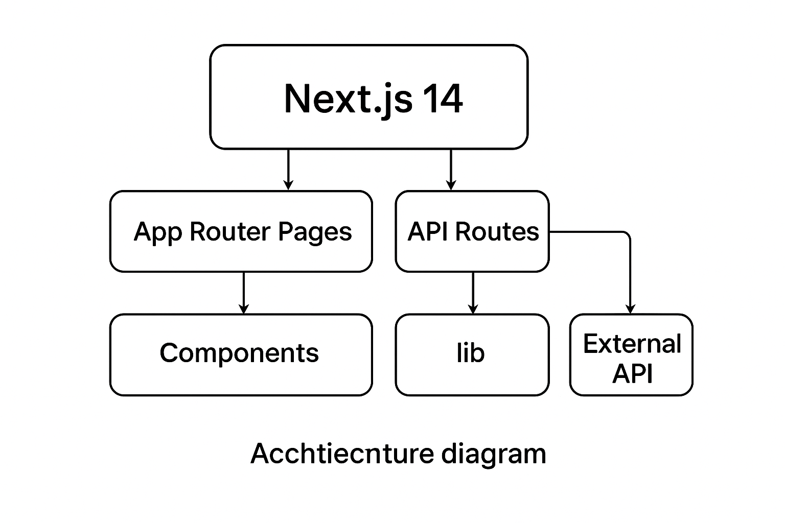

# Project Architecture

The **BLinkOS Platform** is built on top of the Next.js 14 App Router. It follows a modular structure that separates concerns into pages, API routes, reusable components, and utility libraries. The diagram below illustrates the high‑level architecture:

## Description

* **App Router Pages (`app/`)** — Contains route segments such as `dashboard`, `login`, and `marketplace`. Each folder maps to a route and can contain its own `page.tsx` and layout.

* **API Routes (`app/api/`)** — Exposes serverless functions that handle actions like authentication, agent management, tool operations, and stats retrieval. These routes can be connected to the real bl1nk.site backend by replacing the current mock implementations.

* **Components (`components/`)** — Houses reusable React components such as `Navbar`, `AgentCard`, `ToolCard`, and `StatsCard`. Components are designed to be stateless and receive data via props.

* **Library (`lib/`)** — Contains utility functions and classes like the API client (`lib/api.ts`) and authentication configuration (`lib/auth.ts`). These modules centralize business logic and API interactions so pages and components remain lean.

* **External Services** — The project communicates with the bl1nk.site backend through the API client. Authentication is managed via NextAuth.js, supporting credentials and OAuth providers. Additional services like analytics, error tracking, and performance monitoring can be integrated here.

This modular structure makes it straightforward to expand functionality, swap out implementations, and keep the codebase maintainable.